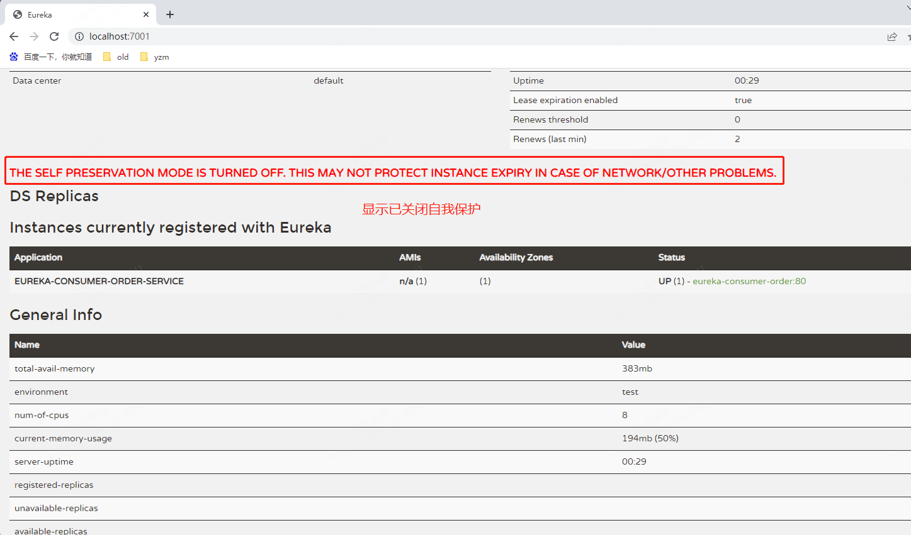

# 什么是服务治理
```text
Spring Cloud 封装了 Netflix 公司开发的 Eureka 模块来实现服务治理

在传统的rpc远程调用框架中，管理每个服务与服务之间依赖关系比较复杂，管理比比较复杂，所以需要使用服务治理，
管理服务于服务之间依赖关系，可以实现服务调用、负载均衡、容错等，实现服务发现与注册。
```
# 什么是服务注册与发现
```text
Eureka采用了CS的设计架构，Eureka Server 作为服务注册功能的服务器，它是服务注册中心。
而系统中的其他电微服务，使用 Eureka的客户端连接到 Eureka Server并维持心跳连接。这样系统的维护人员就可以通过 Eureka Server 来监控系统中各个微服务是否正常运行。
在服务注册与发现中，有一个注册中心。当服务器启动的时候，会把当前自己服务器的信息 比如 服务地址通讯地地址等以别名方式注册到注册中心上。
另一方(消费者|服务提供者)，以该别名的方式去注册中心上获取到实际的服务通讯地址，然后再实现本地RPC调用
RPC远程调用框架核心设计思想:在于注册中心，因为使用注册中心管理每个服务与服务之间的一个依赖关系(服务治理概念)。
在任何rpc远程框架中，都会有一个注册中心(存放服务地址相关信息(接口地址))
```
# Eureka包含两个组件:Eureka Server和Eureka Client
```text
Eureka Server提供服务注册服务
各个微服务节点通过配置启动后，会在EurekaServer中进行注册，这样EurekaServer中的服务注册表中将会存储所有可用服务节点的信息，服务节点的信息可以在界面中直观看到。

EurekaClient通过注册中心进行访问
是一个Java客户端，用干简化Eureka Server的交互，客户端同时也具备一个内置的，使用轮询(round-robin)负载算法的负载均衡器。
在应用启动后，将会向Eureka Server发送心跳(默认周期为30秒)。
如果Eureka Server在多个心跳周期内没有接收到其个节点的心跳，EurekaServer将会从服务注册表中把这个服务节点移除(默认90秒)
```
# 搭建 注册中心
```text
1、添加依赖
<dependency>
    <groupId>org.springframework.cloud</groupId>
    <artifactId>spring-cloud-starter-netflix-eureka-server</artifactId>
</dependency>

2、启动Eureka Server
@SpringBootApplication
@EnableEurekaServer
public class Eureka7001Application {}
```
### 单机模式
```text
eureka:
  instance:
    # eureka服务端的实例名称
    hostname: localhost 
  client:
    # 默认为true。false表示不向注册中心注册自己。
    register-with-eureka: false
    # 默认为true。false表示自己端就是注册中心，我的职责就是维护服务实例，并不需要去检索服务
    fetch-registry: false
    service-url:
      # 设置与 EurekaServer 交互的地址查询服务和注册服务都需要依赖这个地址。
      defaultZone: http://${eureka.instance.hostname}:${server.port}/eureka/   
```
浏览器访问：http://localhost:7001/

### 集群模式 实现负载均衡+故障容错
```text
spring:
  profiles:
    active: peer1

---
spring:
  profiles: peer1
  application:
    name: eureka-server7002

server:
  port: 7002

eureka:
  instance:
    prefer-ip-address: true
    # 这里使用的是，IP地址与域名的映射。找到C:\Windows\System32\drivers\etc下的hosts文件，添加 127.0.0.1 eureka7002.com 进行映射
    hostname: eureka7002.com
  client:
    registerWithEureka: false
    fetchRegistry: false
    serviceUrl:
      defaultZone: http://eureka7003.com:7003/eureka/,http://eureka7004.com:7004/eureka/
      # 或直接使用IP地址
      # defaultZone: http://localhost:7003/eureka/,http://localhost:7004/eureka/

---
spring:
  profiles: peer2
  application:
    name: eureka-server7003

server:
  port: 7003

eureka:
  instance:
    prefer-ip-address: true
    hostname: eureka7003.com
  client:
    registerWithEureka: false
    fetchRegistry: false
    serviceUrl:
      defaultZone: http://eureka7002.com:7002/eureka/,http://eureka7004.com:7004/eureka/

---
spring:
  profiles: peer3
  application:
    name: eureka-server7004

server:
  port: 7004

eureka:
  instance:
    prefer-ip-address: true
    hostname: eureka7004.com
  client:
    registerWithEureka: false
    fetchRegistry: false
    serviceUrl:
      defaultZone: http://eureka7002.com:7002/eureka/,http://eureka7003.com:7003/eureka/ 
```
浏览器访问：
http://localhost:7002/、http://localhost:7003/、http://localhost:7004/
或 
http://eureka7002.com:7002/、http://eureka7003.com:7003/、http://eureka7004.com:7004/


# 自我保护
```text
为什么会产生Eureka自我保护机制?
为了防止EurekaClient可以正常运行，但是与EurekaServer网络不通情况下，EurekaServer不会立刻将EurekaClient服务剔除

什么是自我保护模式?
默认情况下，如果EurekaServer在一定时间内没有接收到某个微服务实例的心跳，EurekaServer将会注销该实例(默认90秒)。
但是当网络分区故障发生(延时、卡顿、拥挤)时，微服务与EurekaServer之间无法正常过通信，以上行为可能变得非常危险了--因为微服务本身其实是健康的，此时本不应该注销这个微服务。
Eureka通过“自我保护模式 来解决这个问题--当EurekaServer节点在短时间内丢失过多客户端时(可能发生了网络分区故障)，那么这个节点就会进入自我我保护模式。

自我保护机制:默认情况下EurekaClient定时向EurekaServer端发送心跳包
如果Eureka在server端在一定时间内(默认90秒)没有收到EurekaClient发送心跳包，便会
直接从服务注册列表中剔除该服务，但是在短时间(90秒中)内丢失了大量的服务实例心跳，
这时候EurekaServer会开启自我保护机制，不会剔除该服务(该现象可能出现在如果网络不通
但是EurekaClient为出现宕机，此时如果换做别的注册中心如果一定时间内没有收到心跳会将
剔除该服务，这样就出现了严重失误，因为客户端还能正常发送心跳，只是网络延迟问题，而
保护机制是为了解决此问题而产生的)

在自我保护模式中，EurekaServer会保护服务注册表中的信息，不再注销任何服务实实例。
它的设计哲学就是宁可保留错误的服务注册信息，也不盲目注销任何可能健康的服务实实例。一句话讲解:好死不如赖活着

综上，自我保护模式是一种应对网络异常的安全保护措施。它的架构哲学是宁可同时呆留所有微服务(健康的微服务和不健康的微服务都会保留)
也不盲目注销任何健康的微服务。使用自我保护模式，可以让Eureka集群更加的健壮、稳定。
```
# 关闭自我保护
```text
服务端：
eureka:
  instance:
    hostname: localhost 
  client:
    register-with-eureka: false
    fetch-registry: false
    service-url:
      defaultZone: http://${eureka.instance.hostname}:${server.port}/eureka/
  server:
    # 是否启动自我保护机制，默认为true。false保证不可用服务被及时踢除
    enable-self-preservation: false
    # 清除过期服务的时间间隔，单位毫秒。默认60000，即一分钟
    eviction-interval-timer-in-ms: 2000    
    
客户端：
eureka:
  client:
    serviceUrl:
      defaultZone: http://localhost:7001/eureka/
  instance:
    # Eureka客户端向服务端发送心跳的时间间隔(证明服务可用)，单位为秒(默认是30秒)
    lease-renewal-interval-in-seconds: 2
    # 告诉服务端，如果当前服务 10s 之内还没有给你发送心跳就表示我已经挂了，将我从注册中心剔除掉，默认值为 90秒
    lease-expiration-duration-in-seconds: 5        
```
