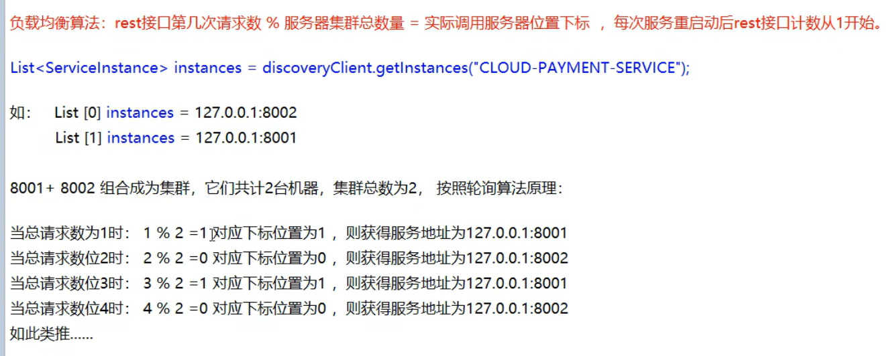

# 简介
```text
Spring Cloud Ribbon是基于Netflix Ribbon实现的一套客户端负载均衡的工具。
简单的说，Ribbon是Netflix发布的开源项目，主要功能是提供客户端的软件负载均衡算法和服务调用。
Ribbon客户端组件提供一系列完善的配置项如连接招时，重计等。简单的说，就是在配置文件中列出Load Balancer(简称LB)后面所有的机器，
Ribbon会自动的帮助你基于某种规则(如简单轮询，随机连接等)去连接这些机器。我们很容易使用Ribbon实现自定义的负载均衡算法。
```
# LB负载均衡(Load Balance)是什么
```text
简单的说就是将用户的请求平摊的分配到多个服务上，从而达到系统的HA (高可用)。常见的负载均衡有软件Nginx，LVS，硬件 F5等

Ribbon本地负载均衡客户端 VS Nginx服务端负载均衡区别
Nginx是服务器负载均衡，客户端所有请求都会交给nginx，然后由nginx实现转发请求。即负载均衡是由服务端实现的。
Ribbon本地负载均衡，在调用微服务接口时候，会在注册中心上获取注册信息服务列表之后缓存到JVM本地，从而在本地实现RPC远程服务调用技术。
```
# 
```text
集中式LB
即在服务的消费方和提供方之间使用独立的LB设施(可以是硬件，如F5，也可以是软件，如nginx),由该设施负责把访问请求通过某种策略转发至服务的提供方;

进程内LB
将LB逻辑集成到消费方，消费方从服务注册中心获知有哪些地址可用，然后自己再从这些地址中选择出一个合适的服务器。
Ribbon就属于进程内LB，它只是一个类库，集成于消费方进程，消费方通过它来获取到服务提供方的地址。
```
# Ribbon自带的负载均衡策略
```text
com.netflixLoadbalancer.RoundRobinRule：轮询
com.netflix.loadbalancer.RandomRule：随机
com.netflix.loadbalancer.RetryRuleDWeightedResponseTimeRule：先按照RoundRobinRule的策略获取服务，如果获取服务失败则在指定时间内会进行重试，获取可用的服务
WeightedResponseTimeRule：对RoundRobinRule的扩展，响应速度越快的实例选择权重越大，越容易被选择
BestAvailableRule：会先过滤掉由于多次访问故障而处于断路器跳闸状态的服务，然后选择一个并发量最小的服务
AvailabilityFilteringRule：先过滤掉故障实例，再选择并发较小的实例
ZoneAvoidanceRule：默认规则,复合判断server所在区域的性能和server的可用性选择服务器
```
# 替换默认的规则
```text
查看服务 consumer-order-ribbon
```
# 算法/原理
