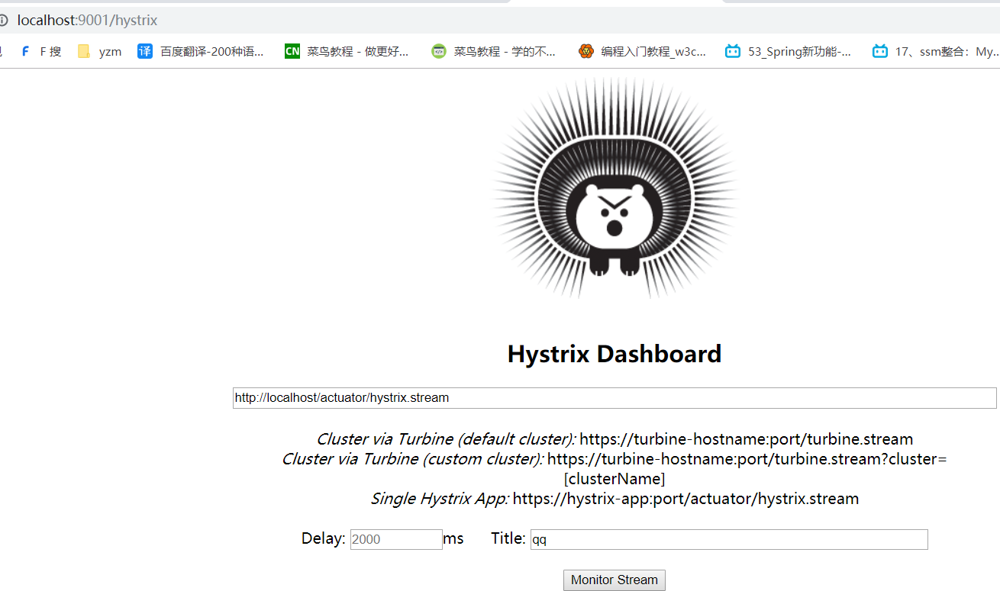

# 服务雪崩
```text
多个微服务之间调用的时候，假设微服务A调用微服务B和微服务C，微服务B和微服务C又调用其它的微服务，这就是所谓的“扇出"
如果扇出的链路上某个微服务的调用响应时间过长或者不可用，对微服务A的调用就会占用越来越多的系统资源，进而引起系统崩溃，所谓的“雪崩效应”
对于高流量的应用来说，单一的后端依赖可能会导致所有服务器上的所有资源都在几秒钟内饱和。
比失败更糟糕的是，这些应用程序还可能导致服务之间的延迟增加，备份队列，线程和其他系统资源紧张，导致整个系统发生更多的级联故障。
这些都表示需要对故障和她迟进行隔离和管理，以便单个依赖关系的失败，不能取消整个应用程序或系统。
所以，通常当你发现一个模块下的某个实例失败后，这时候这个模块依然还会接收流量，然后这个有问题的模块还调用了其他的模块，这样就会发生级联故障，或者叫雪崩。
```
# Hystrix 海斯劝克
```text
Hystrix是一个用于处理分布式系统的延迟和容错的开源库，在分布式系统里，许多依赖不可避免的会调用失败，比如超时、异常等
Hystrix能够保证在一个依赖出问题的情况下，不会导致整体服务失败，避免级联故障，以提高分布式系统的弹性
"断路器”本身是一种开关装置，当某个服务单元发生故障之后，通过断路器的故障监控(类似熔断保险丝)，向调用方返回一个符合预期的、可处理的备选响应(FalBak)，
而不是长时间的等待或者抛出调用方无法处理的异常，这样就保证了服务调用方的线程不会被长时间、不必要地占用，从而避免了故障在分布式系统中的蔓延，乃至雪崩。
```
# 服务降级
作用与服务提供方：eureka-provider-payment-hystrix
```text
1、引入依赖
<dependency>
    <groupId>org.springframework.cloud</groupId>
    <artifactId>spring-cloud-starter-netflix-hystrix</artifactId>
</dependency>
2、启动Hystrix
@SpringBootApplication
@EnableEurekaClient
@EnableHystrix // 开启Hystrix
public class HystrixPaymentApplication {}
3、实现服务降级
@HystrixCommand(fallbackMethod = "fallbackTimeout", commandProperties = {
        @HystrixProperty(name = "execution.isolation.thread.timeoutInMilliseconds", value = "3000")
})
public CommonResult<String> timeout(String port) throws InterruptedException {
    // 超时
    Thread.sleep(3000);
    return CommonResult.success("normal " + port + ", 线程：" + Thread.currentThread().getName());
}

public CommonResult<String> fallbackTimeout(String port) {
    return CommonResult.success("fallback " + port + ", 线程：" + Thread.currentThread().getName());
}
```
作用与服务消费方(调用方)：eureka-consumer-order-hystrix
```text
1、引入依赖
<dependency>
    <groupId>org.springframework.cloud</groupId>
    <artifactId>spring-cloud-starter-netflix-hystrix</artifactId>
</dependency>
<dependency>
    <groupId>org.springframework.cloud</groupId>
    <artifactId>spring-cloud-starter-openfeign</artifactId>
</dependency>
2、启动类
@SpringBootApplication
@EnableEurekaClient
@EnableFeignClients
@EnableHystrix
public class HystrixOrderApplication {}
3、配置
feign:
  hystrix:
    enabled: true
4、使用
@GetMapping("/timeout2")
@HystrixCommand(fallbackMethod = "fallbackTimeout", commandProperties = {
        @HystrixProperty(name = "execution.isolation.thread.timeoutInMilliseconds", value = "2000")
})
public CommonResult<String> timeout2() {
    try {
        Thread.sleep(3000);
    } catch (InterruptedException e) {
    }
    return orderFeign.hello();
}

public CommonResult<String> fallbackTimeout() {
    return CommonResult.success("order " + port + ", 线程：" + Thread.currentThread().getName());
}
```
通常情况用于调用方
配置全局回调
```text
@RestController
@RequestMapping("/order")
@DefaultProperties(defaultFallback = "globalFallback")
public class OrderController {
    
    @GetMapping("/timeout")
    @HystrixCommand
    public CommonResult<String> timeout() {
        return orderFeign.timeout();
    }

    public CommonResult<String> globalFallback() {
        return CommonResult.success("globalFallback " + port + ", 线程：" + Thread.currentThread().getName());
    }
}
```
# 服务熔断
```text
熔断机制概述
熔断机制是应对雪崩效应的一种微服务链路保护机制。当扇出链路的某个微服务出错不可用或者响应时间太长时会进行服务的降级，
进而熔断该节点微服务的调用，快速返回错误的响应信息。当检测到该节点微服务调用响应正常后，恢复调用链路。

在Spring Cloud框架里，熔断机制通过Hystrix实现。Hystrix会监控微服务间调用的状况，当失败的调用到一定闸值，缺省是5秒内20次调用失败，
就会启动熔断机制。熔断机制的注解是@HystrixCommand.
```
```text
涉及到断路器的三个重要参数: 快照时间窗、请求总数阀值、错误百分比阀值。
1、requestVolumeThreshold：
快照时间窗:断路器确定是否打开需要统计一些请求和错误数据，而统计的时间范围就是快照时间窗，默认为最近的10秒。
2、sleepWindowInMilliseconds：
请求总数阀值:在快照时间窗内，必须满足请求总数阀值才有资格熔断。默认为20，意味着在10秒内，如果该hystrix命令的调用次数不足20次即使所有的请求都超时或其他原因失败，断路器都不会打开。
3、errorThresholdPercentage：
错误百分比网值:当请求总数在快照时间窗内超过了网值，比发生了30次调用，如果在这30次调用中，有15次发生了超时异常，也就是超的50%的错误百分比，在默认设定50%阀值情况下，这时候就会将断路器打开。
```
# 服务限流
```text

```
# dashboard图形监控
```text
1、依赖
<dependency>
    <groupId>org.springframework.cloud</groupId>
    <artifactId>spring-cloud-starter-netflix-hystrix</artifactId>
</dependency>
<dependency>
    <groupId>org.springframework.cloud</groupId>
    <artifactId>spring-cloud-starter-netflix-hystrix-dashboard</artifactId>
</dependency>
2、启动
@SpringBootApplication
@EnableEurekaClient
@EnableHystrixDashboard
@EnableHystrix
public class DashboardApplication {}
3、浏览器访问
http://localhost:9001/hystrix
```

被监控服务
```text
1、监控服务
需添加：
@Bean
public ServletRegistrationBean getServlet() {
    HystrixMetricsStreamServlet streamServlet = new HystrixMetricsStreamServlet();
    ServletRegistrationBean registrationBean = new ServletRegistrationBean(streamServlet);
    registrationBean.setLoadOnStartup(1);
    registrationBean.addUrlMappings("/actuator/hystrix.stream");
    registrationBean.setName("HystrixMetricsStreamServlet");
    return registrationBean;
}
2、@EnableHystrix注解
3、在9001页面添加
http://localhost/actuator/hystrix.stream
4、先访问一下有降级熔断的方法，如有@HystrixCommand修饰的方法
```

# Turbine 聚合监控
```text
1、依赖
<dependency>
    <groupId>org.springframework.cloud</groupId>
    <artifactId>spring-cloud-starter-netflix-turbine</artifactId>
</dependency>
2、
@SpringBootApplication
@EnableHystrixDashboard
@EnableTurbine
@EnableEurekaClient
public class TurbineApplication {}
3、yml
turbine:
  # 配置监控服务的列表，表明监控哪些服务多个使用","分割  
  app-config: eureka-consumer-order-hystrix-service,eureka-provider-payment-hystrix-service 
  cluster-name-expression: new String("default")
  combine-host-port: true
  
4、浏览器访问 http://localhost:9002/hystrix
输入：http://localhost:9002/turbine.stream
```


