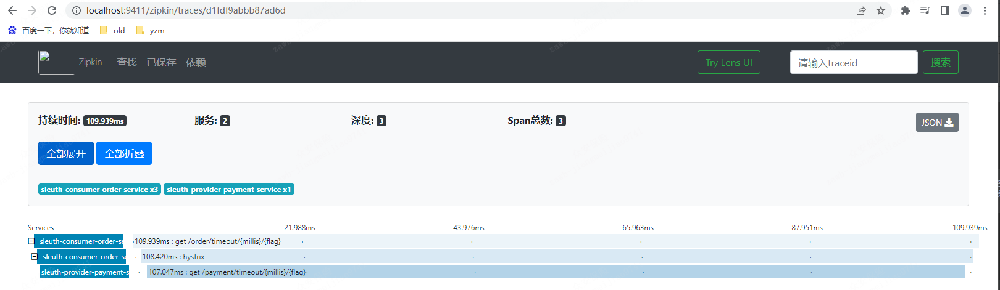

# 简介
```text
Spring Cloud Sleuth提供了一套完整的服务跟踪的解决方案
在分布式系统中提供追踪解决方案并且兼容支持了zipkin
```
# 使用
```text
在spring Cloud为F版本的时候，已经不需要自己构建Zipkin Server了，只需要下载jar即可，访问下载地址：
https://search.maven.org/remote_content?g=io.zipkin.java&a=zipkin-server&v=LATEST&c=exec

下载完成jar 包之后，需要运行jar，如下：java -jar zipkin-server-2.10.1-exec.jar
打开浏览器访问：http://localhost:9411/zipkin/
```
